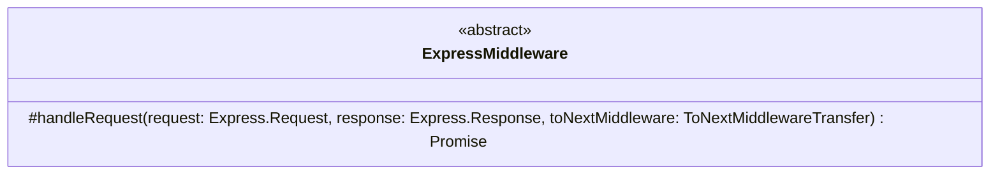

# Yamato Daiwa Express Extensions

Additional functions for [express](https://www.npmjs.com/package/express) and its plugins, and also for 
  [routing-controllers](https://www.npmjs.com/package/routing-controllers).


## Installation

```Bash
npm i @yamato-daiwa/express-extensions -E
```

Also, install the following peer dependencies if not installed yet.

+ **body-parser**: ~2.2.0
+ **express**: ~5.1.0
+ **express-session**: ~1.18.0
+ **routing-controllers**: ~0.11.0


## Functionality

+ [`ExpressMiddleware`](#expressmiddleware)
+ [`initializeRoutingControllersExpressHTTPS_Application`](#initializeroutingcontrollersexpresshttps_application)
+ [`redirectOnNotFound`](#redirectonnotfound)
+ [`Route`](#route)
+ [`QueryParametersProcessor`](#queryparametersprocessor)

+ Session

  + [`saveExpressSession`](#saveexpresssession)
  + [`disposeExpressSession`](#disposeexpresssession)
  
+ Request Body

  + [`parseAndValidateJSON_RequestBody`](#parseandvalidatejson_requestbody)
  + [`validateAndProcessJSON_RequestBody`](#validateandprocessrequestbody) 


### `ExpressMiddleware`

The abstract class intended to be extended for the creating of Express middleware and using with
  [`@UseBefore` and `@UseAfter` decorators](https://www.npmjs.com/package/routing-controllers/v/0.6.0-beta.3#using-middlewares).
Unlike [`MiddlewareInterface` and `@Middleware()` decorator](https://www.npmjs.com/package/routing-controllers/v/0.6.0-beta.3#creating-your-own-express-middleware) 
  of **routing-controllers**, has safely typed parameters.



The only method need to be implemented is `handleRequest`:

```
(
  request: Express.Request,
  response: Express.Response,
  toNextMiddleware: ExpressMiddleware.ToNextMiddlewareTransfer
): Promise<void>
```

#### Example

```typescript
import type Express from "express";
import { ExpressMiddleware } from "@yamato-daiwa/express-extensions";
import { Logger } from "@yamato-daiwa/es-extensions";


export default class DebuggerMiddleware extends ExpressMiddleware {

  protected override async handleRequest(
    request: Express.Request,
    response: Express.Response,
    toNextMiddleware: ExpressMiddleware.ToNextMiddlewareTransfer
  ): Promise<void> {

    Logger.logInfo({
      title: "DebuggerMiddleware",
      description: "",
      additionalData: {
        request,
        response
      }
    });

    toNextMiddleware();
    return Promise.resolve();

  }

}
```

### `initializeRoutingControllersExpressHTTPS_Application`

Initializer of the application using **routing-controllers**, **Express** and **HTTPS protocol**.  

```ts
(
  {
    configuration: {
      HTTPS,
      routingControllers
    },
    eventsHandlers: {
      onExpressApplicationCreated,
      onHTTPS_ServerCreated,
      onRoutingControllersSetupComplete,
      onApplicationStarted
    }
  }: Readonly<{

    configuration: Readonly<{
      
      HTTPS: Readonly<
        { port: number; } &
        (
          (
            { SSL_Key: string; } |
            { SSL_KeyFilePath__absoluteOrRelative: string; }
          ) &
          (
            { SSL_Certificate: string; } |
            { SSL_CertificateFilePath__absoluteOrRelative: string; }
          ) 
        )
      >;
      routingControllers: RoutingControllersOptions;
    }>;

    eventsHandlers: Readonly<{
      onExpressApplicationCreated: (expressApplication: ExpressApplication) => Promise<void>;
      onHTTPS_ServerCreated?: (HTTPS_Server: NodeHTTPS.Server, expressApplication: ExpressApplication) => Promise<void>;
      onRoutingControllersSetupComplete?: () => Promise<void>;
      onApplicationStarted?: () => Promise<void>;
    }>;

  }>
): Promise<void>
```


#### Background

The initialization of **routing-controllers** + **Express** + **HTTPS** application 
  [has not been documented well](https://github.com/typestack/routing-controllers/discussions/1243) 
  and a little bit complicated:

```ts
import Express, { type Express as ExpressApplication } from "express";
import createExpressApplication from "express";
import { useExpressServer as supportClassSyntax } from "routing-controllers";

import HTTPS from "https";
import FileSystem from "fs";


const expressApplication: ExpressApplication = createExpressApplication();

expressApplication.get(
  "/",
  (_request: Express.Request, response: Express.Response): void => {
    response.send("<h1>Hello, world!</h1>");
  }
);

const HTTPS_Server: HTTPS.Server = HTTPS.createServer(
  {
    key: FileSystem.readFileSync("./SSL/key.pem"),
    cert: FileSystem.readFileSync("./SSL/cert.pem")
  },
  expressApplication
);

supportClassSyntax(expressApplication);

HTTPS_Server.listen(443, "127.0.0.1");
```

**initializeRoutingControllersExpressHTTPS_Application** encapsulates this complexity.


#### Configuration

##### `HTTPS` - The HTTPS Requirements

<dl>

  <dt><code>HTTPS</code></dt>
  <dd>
    <dl>
      <dt>Type</dt>
      <dd>String</dd>
      <dt>Is Required</dt>
      <dd>Yes</dd>
      <dt>Description</dt>
      <dd>
        HTTPS port number will be listened.
        Valid port number expected.
      </dd>
    </dl>
  </dd>

  <dt><code>SSL_Key</code></dt>
  <dd>
    <dl>
      <dt>Type</dt>
      <dd>String</dd>
      <dt>Required If</dt>
      <dd><code>SSL_KeyFilePath__absoluteOrRelative</code> not specified</dd>
      <dt>Description</dt>
      <dt>Description</dt>
      <dd>The string which must represent the valid SSL key.</dd>
    </dl>
  </dd>

  <dt><code>SSL_KeyFilePath__absoluteOrRelative</code></dt>
  <dd>
    <dl>
      <dt>Type</dt>
      <dd>String</dd>
      <dt>Required If</dt>
      <dd><code>SSL_Key</code> not specified</dd>
      <dt>Description</dt>
      <dd>Expected the valid path (absolute or relative) of the existing file contains the valid SSL key.</dd>
    </dl>
  </dd>

  <dt><code>SSL_Certificate</code></dt>
  <dd>
    <dl>
      <dt>Type</dt>
      <dd>String</dd>
      <dt>Required If</dt>
      <dd><code>SSL_CertificateFilePath__absoluteOrRelative</code> not specified</dd>
      <dt>Description</dt>
      <dd>The string which must represent the valid SSL certificate.</dd>
    </dl>
  </dd>

  <dt><code>SSL_CertificateFilePath__absoluteOrRelative</code></dt>
  <dd>
    <dl>
      <dt>Type</dt>
      <dd>String</dd>
      <dt>Required If</dt>
      <dd><code>SSL_Certificate</code> not specified</dd>
      <dt>Description</dt>
      <dd>Expected the valid path (absolute or relative) of the existing file contains the valid SSL certificate.</dd>
    </dl>
  </dd>

</dl>


##### `routingControllers` - The "routing-controllers" configuration

Options of [routing-controllers](https://www.npmjs.com/package/routing-controllers/v/0.11.3).
See the [TypeScript type definitions of `RoutingControllersOptions` type](https://app.unpkg.com/routing-controllers@0.11.3/files/types/RoutingControllersOptions.d.ts)
  for reference.


#### Events Handers
##### `onExpressApplicationCreated`

```
(expressApplication: ExpressApplication) => Promise<void>
```

As it obviously from the function name, called when basic Express application created.
Basically being used to use the Express plugins and middlewares.

+ **routing-controllers** library has not been involved yet.
+ The express application instance will be passed via parameter.


##### `onHTTPS_ServerCreated`

```
(HTTPS_Server: NodeHTTPS.Server, expressApplication: ExpressApplication) => Promise<void>
```

As it obviously from the function name, called when the HTTPS server created.

+ **routing-controllers** library has not been involved yet.
+ The HTTPS server instance, and also the express application instance will be passed via parameters.


##### `onRoutingControllersSetupComplete`

```
(expressApplication: ExpressApplication) => Promise<void>;
```

As it obviously from the function name, called when the **routing-controllers** functionality has been initialized.


##### `onRoutingControllersSetupComplete`

```
() => Promise<void>
```

As it obviously from the function name, called when the application　actually started and ready to accept the HTTP
  requests.
Usually being called to log the application starting.


### `redirectOnNotFound`

```
redirectOnNotFound(targetRoute: string): (_request: Express.Request, response: Express.Response) => void
```

Redirects to specified route when `response.headersSent` value is false.
Intended to be used via `expressApplicationUse()` _after_ the initialization of **routing-controllers** application
  complete to redirect to "Not found" page.

Although with the plain Express the "Not found" page is being provided by other way, with **routing-controllers** the
  [usual ways may not work](https://github.com/typestack/routing-controllers/discussions/1476) because of incorrectly
  arranged routes.
There is no official recommendation how to redirect to "Not found" page when no route matchings found so
  `redirectOnNotFound` function may be used for such purposes. 


### `Route`

The adapter for `Method` decorator from **routing-controllers** to `HTTP_Methods` enumeration from 
  ["fundamental-constants"](https://www.npmjs.com/package/fundamental-constants)/["@yamato-daiwa/es-extensions"](https://www.npmjs.com/package/@yamato-daiwa/es-extensions).


### `QueryParametersProcessor`

`@QueryParametersProcessor.process` is the alternative 
  [`@QueryParams`](https://github.com/typestack/routing-controllers?tab=readme-ov-file#inject-query-parameters) from 
  **routing-controllers**.
In comparison with `@QueryParams`,

+ Has customizable deserialization (does not use pre-deserialized `request.query`)
+ Validation without additional classes via [`RawObjectDataProcessor` API](https://github.com/TokugawaTakeshi/Yamato-Daiwa-ES-Extensions/blob/master/CoreLibrary/Package/Documentation/RawObjectDataProcessor/RawObjectDataProcessor.md);
+ Possible to modify object to which query string has been deserialized as far as `RawObjectDataProcessor` supports. 


```typescript
import { Controller, Get, Reader } from "routing-controllers";
import { QueryParametersProcessor } from "@yamato-daiwa/express-extensions";
import { RawObjectDataProcessor } from "@yamato-daiwa/es-extensions";


@Controller()
export default class UserController {

  @Get("/componets/users/edtior/new")
  @Reader("Components/UserEditor/ForNewUser/EditorForNewUser.mvc.component.hbs")
  protected async renderUserEditorFragmentForNewUser(
    @QueryParametersProcessor.process({
      userType: {
        type: String,
        required: true,
        allowedAlternatives: Object.values(User.Types)
      },
      willBeFirstAmongOnesOfSameType: {
        preValidationModifications: [ destringifyBooleanValue ],
        type: Boolean,
        required: true
      },
      currentContOfUsersOfSameType: {
        preValidationModifications: [ convertPotentialStringToIntegerIfPossible ],
        type: Number,
        numbersSet: RawObjectDataProcessor.NumbersSets.naturalNumber,
        required: true
      }
    })
    {
      userType,
      willBeFirstAmongOnesOfSameType,
      currentContOfUsersOfSameType
    }: Readonly<{
      
    }>
  ): Promise<EditorForNewUserMVC_FragmentVariables> {
    
    console.log(userType)
    console.log(willBeFirstAmongOnesOfSameType)
    console.log(currentContOfUsersOfSameType)
  
    // ...
    
  }

}
```

#### Query parameters deserializing

To set the default deserializer, use `setDefaultDeserializer` static method of `QueryParametersProcessor`.

```
import { QueryParametersProcessor } from "@yamato-daiwa/express-extensions"; 
import QueryString from "qs";


QueryParametersProcessor.setDefaultDeserializer(QueryString.parse)
```

The parameter must be the functions accepts the serialized (thus the string) query parameters and return
  JSON-compatible type.

Obvious but frequently missed out: the deserializing algorithm on backend must correspond to serializing
  algorithm on frontend.
Well, the `QueryString.parse()` is predefined deserializer for `QueryParametersProcessor` but even you are
  fine with this one, add above code to your application to explicitly show that you selected this serializer
  consciously.

Additionally, you can set the custom deserializer per request what is basically not recommended but inevitably
  if development of the client part is out your control.

```typescript
import { Controller, Get, Reader } from "routing-controllers";
import { QueryParametersProcessor } from "@yamato-daiwa/express-extensions";
import { RawObjectDataProcessor, type ReadonlyParsedJSON_Object } from "@yamato-daiwa/es-extensions";


@Controller()
export default class UserController {

  @Get("/componets/users/edtior/new")
  @Reader("Components/UserEditor/ForNewUser/EditorForNewUser.mvc.component.hbs")
  protected async renderUserEditorFragmentForNewUser(
    @QueryParametersProcessor.process(
      {
        userType: {
          type: String,
          required: true,
          allowedAlternatives: Object.values(User.Types)
        },
        // ...
      },
      (queryString: string): ReadonlyParsedJSON_Object => {
        // ....
      }
    )
    {
      userType,
      willBeFirstAmongOnesOfSameType,
      currentContOfUsersOfSameType
    }: Readonly<{
      
    }>
  ): Promise<EditorForNewUserMVC_FragmentVariables> {
    
    console.log(userType)
    console.log(willBeFirstAmongOnesOfSameType)
    console.log(currentContOfUsersOfSameType)
  
    // ...
    
  }

}
```

#### `QueryParametersDeserializingError`

If error will occur during query parameters deserializing, the `QueryParametersProcessor.QueryParametersDeserializingError`
  will be thrown. 
You can detect it via `error instanceof QueryParametersProcessor.QueryParametersDeserializingError`
  or `error instanceof HttpError` because `QueryParametersProcessor.QueryParametersDeserializingError`
  extended from `HttpError` of **routing-controllers**.


### Session
#### `saveExpressSession`

```
saveExpressSession(session: Session): Promise<void>
```

The promisfied version of [`session.save(callback)`](https://www.npmjs.com/package/express-session#user-content-sessionsavecallback).
The promise will reject if the callback of `session.save` will receive
  neither undefined nor null parameter.


#### `disposeExpressSession`

```
# === [ Overload 1 ] Must wait until completion
(session: Session, options: Readonly<{ mustWaitUntilCompletion: true; }>): Promise<void>;

# === [ Overload 2 ] Do not wait until completion
(session: Session, options: Readonly<{ mustWaitUntilCompletion: false; }>): void;
```

The wrapper for [`session.destroy(callback)`](https://www.npmjs.com/package/express-session#user-content-sessiondestroycallback).

* If the second parameter has been set to `{ mustWaitUntilCompletion: true }`, this function will return the promise which
    will be resolved when the disposal will successfully complete. 
  In this case, the `disposeExpressSession` is the promisfied version of `session.destroy(callback)`. 
* If there is no need to wait the ending of disposal, set the second parameter to `{ mustWaitUntilCompletion: false }` 
    and this function will return nothing.
  

### Request Body
#### `parseAndValidateJSON_RequestBody`

```
<RequestData extends ReadonlyParsedJSON>(
  settings: Readonly<{
    requestBodySizeLimit__bytesPackageFormat: string | number;
    validationAndProcessing: RawObjectDataProcessor.ObjectDataSpecification;
    mustLogDataAfterParsing?: boolean;
  }>
): ExpressMiddleware
```

Parses expected to be the JSON-type request body, validates it by [RawObjectDataProcessor](https://github.com/TokugawaTakeshi/Yamato-Daiwa-ES-Extensions/blob/master/CoreLibrary/Package/Documentation/RawObjectDataProcessor/RawObjectDataProcessor.md)
  and, if demanded, modifying it by same util.
The *alternative* to [class-transformer](https://github.com/typestack/class-transformer) which is transforming the
  request body to the instances of classes for the cases when there is no need to turn the objects to the instances
  of the classes.

* Requirements 
  1. **body-parser** has _not_ been applied neither globally nor locally, by other words, the request body
    has not been parsed yet.
  2. The **class-transformer** is disabled by `useExpressServer({ classTransformer: false })` where the `useExpressServer`
     is the function from **routing-controllers** 
* Intended to be used as one of parameters of **routing-controllers** middleware.


#### `validateAndProcessJSON_RequestBody`

```
<RequestData extends ReadonlyParsedJSON>(
  validationAndProcessing: RawObjectDataProcessor.ObjectDataSpecification,
  { mustLogDataAfterParsing = false }: Readonly<{ mustLogDataAfterParsing?: boolean; }> = { mustLogDataAfterParsing: false }
): ExpressMiddleware
```

Validates the pre-parsed JSON body by [RawObjectDataProcessor](https://github.com/TokugawaTakeshi/Yamato-Daiwa-ES-Extensions/blob/master/CoreLibrary/Package/Documentation/RawObjectDataProcessor/RawObjectDataProcessor.md)
  and, if demanded, modifying it by same util.
The *alternative* to [class-transformer](https://github.com/typestack/class-transformer) which is transforming the
  request body to the instances of classes for the cases when there is no need to turn the objects to the instances
  of the classes.

* Requirements
  1. The JSON-type request body has been preliminary parsed by **body-parser**.
  2. The **class-transformer** is disabled by `useExpressServer({ classTransformer: false })` where the `useExpressServer`
     is the function from **routing-controllers**
* Intended to be used as one of parameters of **routing-controllers** middleware.
